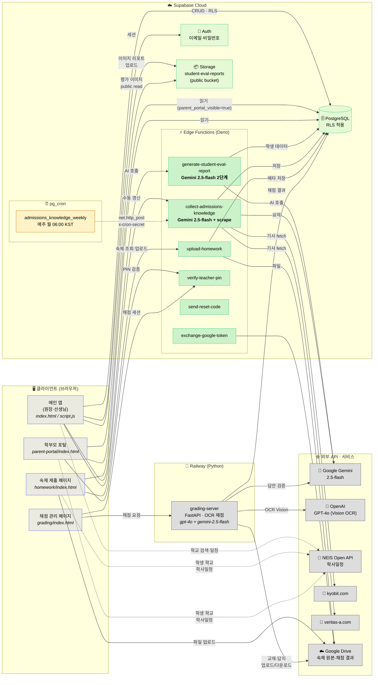
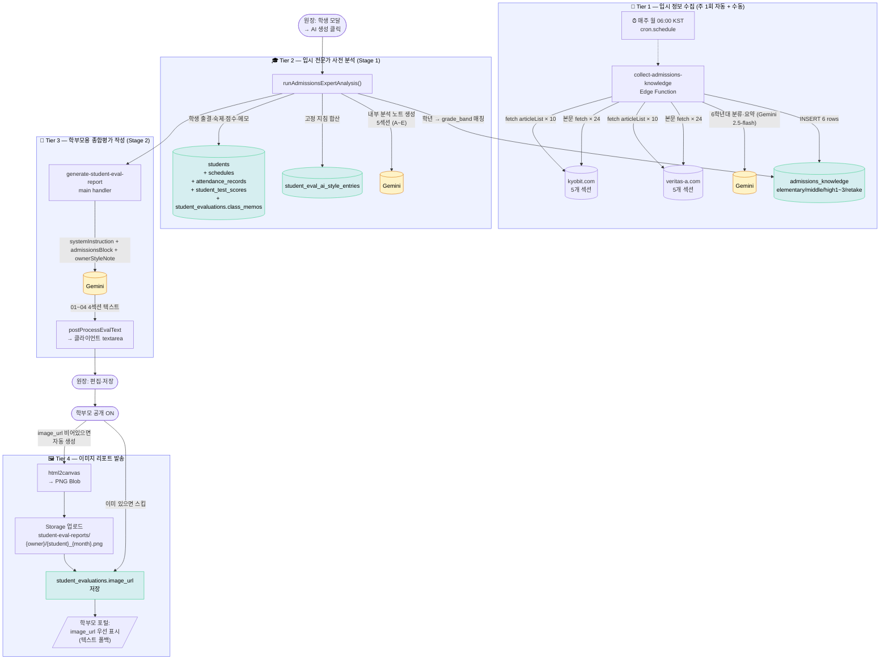
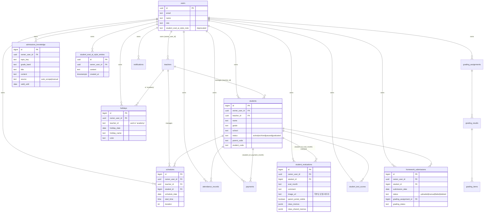
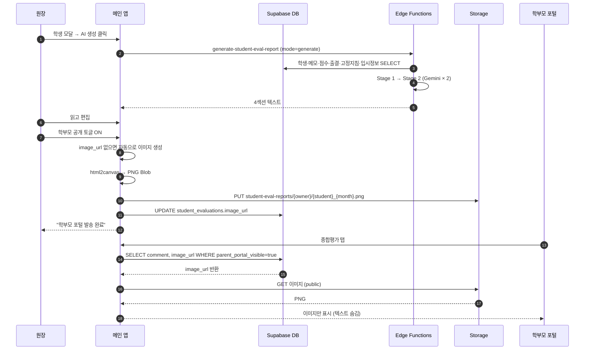

# Academy Manager — 시스템 아키텍처

> 마지막 갱신: 2026-05-10
>
> Mermaid 다이어그램은 GitHub·VS Code (Markdown Preview Mermaid Support 확장) 등에서
> 자동으로 이미지로 렌더링됩니다. 미리보기가 안 보이면 [mermaid.live](https://mermaid.live) 에 코드를 붙여넣어 확인.

---

## 1. 전체 시스템 — Top-level Architecture

---

## 2. 종합평가 AI 데이터 흐름 — 3-Tier RAG 파이프라인

---

## 3. 주요 DB 테이블 ER (간소화)

---

## 4. AI 모델 사용 매트릭스

| 호출 위치 | 모델 | 용도 | 비용 (대략) |
|---|---|---|---|
| `generate-student-eval-report` Stage 1 | gemini-2.5-flash | 입시 전문가 사전 분석 | $0.001 / 평가 |
| `generate-student-eval-report` Stage 2 | gemini-2.5-flash | 학부모용 4섹션 작성 | $0.002 / 평가 |
| `collect-admissions-knowledge` | gemini-2.5-flash | 6학년대 트렌드 요약 | $0.003 / 회 (주 1회) |
| `grading-server` 일반 검증 | gemini-2.5-flash | 채점 답안 검증 | 호출당 $0.001 |
| `grading-server` 일괄 OCR | gpt-4o | 다중 이미지 OCR (chunk) | 호출당 $0.02–0.05 |
| `grading-server` 타이브레이크 OCR | gpt-4o | 1문제 정밀 검증 | 호출당 $0.01 |

---

## 5. 인증·권한 (RLS 요약)

| 리소스 | 누구 | 제한 |
|---|---|---|
| `students` | 원장 | `owner_user_id = auth.uid()` |
| `schedules`, `attendance_records`, `payments` | 원장 | 동일 |
| `student_evaluations` SELECT | 원장 + 학부모(파라미터로 부모 코드 검증) | parent_portal_visible=true 시 학부모 조회 가능 |
| `student_evaluations.image_url` | 학부모 | 동일 (텍스트 대신 이미지 우선) |
| `student-eval-reports` Storage | public read | 누구나 URL 알면 가능 (실제 path 는 owner_uuid + 학생 ID 조합으로 추측 어려움) |
| `admissions_knowledge` | 원장만 | RLS 4개 정책 (select/insert/update/delete) |
| `student_eval_ai_style_entries` | 원장만 | RLS |

---

## 6. 외부 API 키 위치

| API 키 | 저장 위치 | 사용처 |
|---|---|---|
| `GEMINI_API_KEY` | Supabase Edge Secrets, Railway env | Edge Functions, grading-server |
| `OPENAI_API_KEY` | Railway env | grading-server (OCR) |
| `CRON_SECRET` | Supabase Edge Secrets, pg_cron job body | 자동 갱신 인증 |
| Google OAuth | Supabase Edge Secrets, Railway env | Drive 업로드 |
| NEIS API key | 클라이언트 JS 하드코딩 (공개 키) | 학사일정 |

---

## 7. 데이터 라이프사이클

